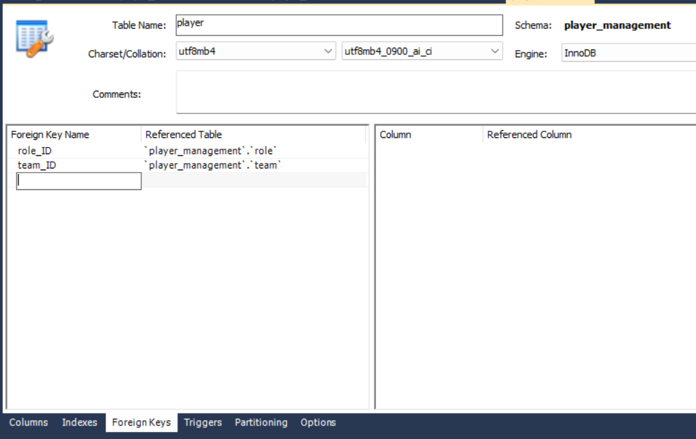

# Database Setup Instructions

## Prerequisites
Before downloading, ensure you have the following installed on your devices:
- [PyCharm](https://www.jetbrains.com/pycharm/download/)
- [MySQL Workbench](https://dev.mysql.com/downloads/workbench/)
- [SQL](https://www.microsoft.com/en-us/sql-server/sql-server-downloads)

## Step 1: Download Necessary Files
Download all the necessary files, including the `admin_information.sql` file.

## Step 2: Update Database Connection
In the `database.py` file, connect it to your MySQL Workbench by updating the connection information as shown below:

MAKE SURE TO CHANGE THE NECESSARY DETAILS SUCH AS THE HOST!!!!

## Step 3: Create Tables in MySQL Workbench
Here are the table settings for your MySQL Workbench:

### Admin Table

### Player Table

### Role Table

### Team Table

### Coach Table

### Player Performance Table

## Step 4: Insert Values in the Database
When inserting values into the database, follow this order:
1. Role
2. Coach
3. Team
4. Player
5. Player Performance

## Step 5: Enjoy Testing!
Feel free to give feedback and suggestions!

---
